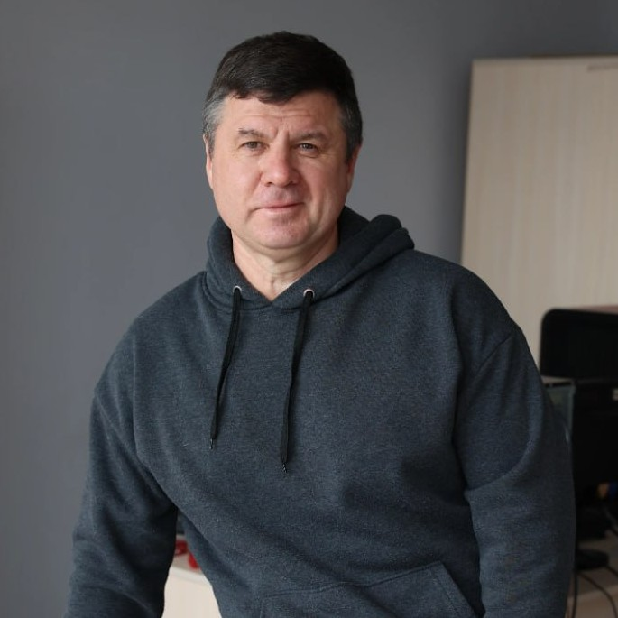
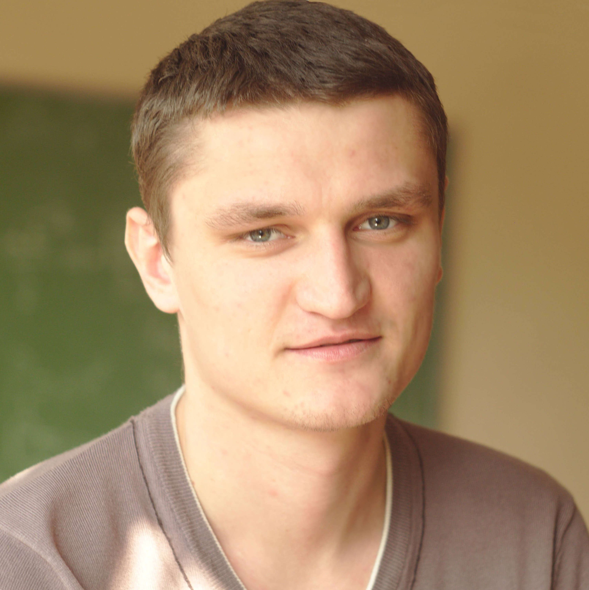
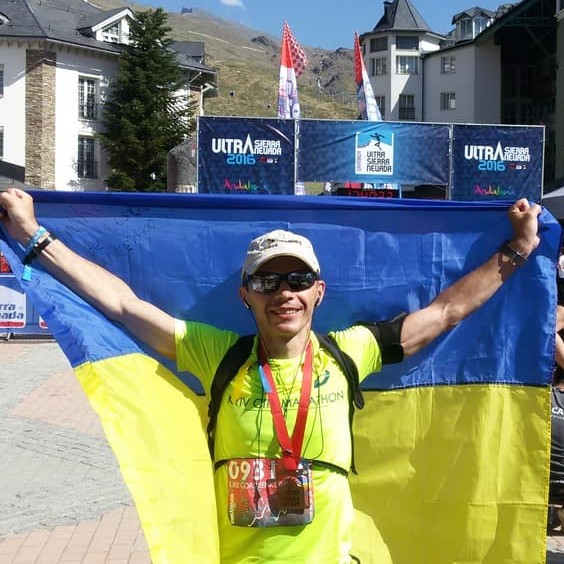
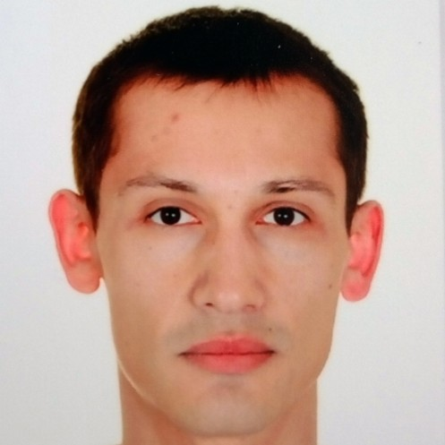
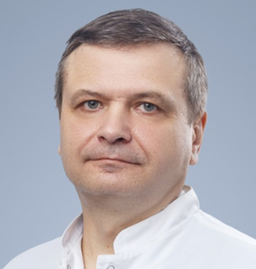

class: middle, center,  black-slide, title-slide

background-image: url(./figures/pic/voice-wave.gif)
background-size: cover

    

  

.larger-x.success[ПЛАТФОРМА ШТУЧНОГО IНТЕЛЕКТУ ДЛЯ ДИСТАНЦIЙНОГО АВТОМАТИЗОВАНОГО ВИЯВЛЕННЯ ТА ДIАГНОСТИКИ ЗАХВОРЮВАНЬ ЛЮДИНИ
] 

  

  .larger-x.bold[Біомедична інженерія і здоров’я людини]  

.left[Науковий керiвник 
.bold[Стіренко Сергій Григорович], д.т.н, проф.]  

Київ, 2025

  

---

class:  black-slide,
background-image: url("https://www.dropbox.com/scl/fi/ples3jkjtxpmh7j9l81w9/vecteezy-2.gif?rlkey=bfzhdgfcegdavmgl5dnnfdgof&st=1n6pcl3y&dl=1")
background-size: cover

# Зміст

.larger-x[ 
 

🎙️ Команда розробників  
🎙️ Опис проєкту   
🎙️    
🎙️   
🎙️     
🎙️          

]

---

class:  black-slide, middle, center
background-image: url("https://www.dropbox.com/scl/fi/ples3jkjtxpmh7j9l81w9/vecteezy-2.gif?rlkey=bfzhdgfcegdavmgl5dnnfdgof&st=1n6pcl3y&dl=1")
background-size: cover

.shadow.larger-xxx[Команда розробників]

---

class:  black-slide, middle
background-image: url("https://www.dropbox.com/scl/fi/ples3jkjtxpmh7j9l81w9/vecteezy-2.gif?rlkey=bfzhdgfcegdavmgl5dnnfdgof&st=1n6pcl3y&dl=1")
background-size: cover
count: false

.grid[
.kol-1-3[ 
.circle.center.width-60[]
.smaller-x.bold.center[.width-10[] Стіренко Сергій Григорович.smaller-x[$^1$]] 

.circle.center.width-60[]
.smaller-x.bold.center[.width-10[] Роковий Олександр Петрович.smaller-x[$^1$]] 

.circle.center.width-60[]
.smaller-x.bold.center[.width-10[] Кочура Юрій  Петрович.smaller-x[$^1$]] 
]
.kol-1-3[ 
.circle.center.width-60[]
.smaller-x.bold.center[.width-10[] Гордієнко Юрій Григорович.smaller-x[$^1$]] 

.circle.center.width-60[]
.smaller-x.bold.center[.width-10[] Алєнін Олег  Ігорович.smaller-x[$^1$]] 
]

.kol-1-3[ 
.circle.center.width-60[]
.smaller-x.bold.center[.width-10[] Павлюченко Михайло Іванович.smaller-x[$^2$]] 

.circle.center.width-60[]
.smaller-x.bold.center[.width-10[] Таран Владислав  Ігорович.smaller-x[$^1$]]
]

.kol-2-3[ .smaller-x[.smaller-x[$^1$] КПІ ім. Ігоря Сікорського, кафедра ОТ, ФІОТ 
.smaller-x[$^2$]  Запорізький державний медичний університет]]
]

---

class:  black-slide, middle, center
background-image: url("https://www.dropbox.com/scl/fi/ples3jkjtxpmh7j9l81w9/vecteezy-2.gif?rlkey=bfzhdgfcegdavmgl5dnnfdgof&st=1n6pcl3y&dl=1")
background-size: cover

.shadow.larger-xxx[Опис проєкту]

---
class:  black-slide, 

- У галузi охорони здоров’я спостерiгається стрiмке зростання застосування методiв штучного iнтелекту та збiльшення числа лiкарiв, якi використовують iнтелектуальнi методи обробки даних для прийняття клiнiчних рiшень.

---

class:  black-slide, 
count:false

- .inactive-b[У галузi охорони здоров’я спостерiгається стрiмке зростання застосування методiв штучного iнтелекту та збiльшення числа лiкарiв, якi використовують iнтелектуальнi методи обробки даних для прийняття клiнiчних рiшень.] 
- Особливе значення має застосування методiв комп’ютерного зору для аналiзу .bold[рентгенограм грудної клiтки] &mdash; найпоширенiшого радiологiчного дослiдження, яке виконує ключову роль для скринiнгу, дiагностики та лiкування захворювань органiв грудної порожнини, багато з яких є лiдируючими причинами смертностi у всьому свiтi.

---

class:  black-slide,
count:false

- .inactive-b[У галузi охорони здоров’я спостерiгається стрiмке зростання застосування методiв штучного iнтелекту та збiльшення числа лiкарiв, якi використовують iнтелектуальнi методи обробки даних для прийняття клiнiчних рiшень.] 
- .inactive-b[Особливе значення має застосування методiв комп’ютерного зору для аналiзу рентгенограм грудної клiтки &mdash; найпоширенiшого радiологiчного дослiдження, яке виконує ключову роль для скринiнгу, дiагностики та лiкування захворювань органiв грудної порожнини, багато з яких є лiдируючими причинами смертностi у всьому свiтi.]
- Сучаснi системи комп’ютерного зору продемонстрували високу ефективнiсть у задачах класифiкацiї та сегментацiї медичних зображень, проте iснує потреба в їх оптимiзацiї для досягнення точностi, швидкодiї та надiйностi, спiвставних або вищих за результати експертiв-радiологiв. 

---

class:  black-slide,
count:false

- .inactive-b[У галузi охорони здоров’я спостерiгається стрiмке зростання застосування методiв штучного iнтелекту та збiльшення числа лiкарiв, якi використовують iнтелектуальнi методи обробки даних для прийняття клiнiчних рiшень.] 
- .inactive-b[Особливе значення має застосування методiв комп’ютерного зору для аналiзу рентгенограм грудної клiтки &mdash; найпоширенiшого радiологiчного дослiдження, яке виконує ключову роль для скринiнгу, дiагностики та лiкування захворювань органiв грудної порожнини, багато з яких є лiдируючими причинами смертностi у всьому свiтi.]
- .inactive-b[Сучаснi системи комп’ютерного зору продемонстрували високу ефективнiсть у задачах класифiкацiї та сегментацiї медичних зображень, проте iснує потреба в їх оптимiзацiї для досягнення точностi, швидкодiї та надiйностi, спiвставних або вищих за результати експертiв-радiологiв.]
-  Раннє виявлення легеневих патологій, зокрема онкологічних, відкриває можливість пацієнтам отримувати ефективне лікування на початкових етапах, що суттєво підвищує шанси на одужання та зменшує ризик ускладнень. Це обумовлює актуальнiсть розробки нових комплексних методiв глибинного машинного навчання для аналізу медичних даних.

---

class:  black-slide, middle
count:false

.exercise[Запропонована в рамках конкурсу платформа штучного iнтелекту для дистанцiйного автоматизованого виявлення та дiагностики захворювань людини дозволить кiнцевим споживачам (працiвникам медичних закладiв) створювати, розгортати та керувати спецiалiзованими ШI-додатками у гiбридних обчислювальних середовищах (на основi хмарних та периферiйних обчислень) з метою підтримки прийняття клінічних рішень та прискорення обробки великих обсягiв даних, що є критично важливим для реалiзацiї широкомасштабних скринiнгових програм та нацiональних iнiцiатив у сферi охорони здоров’я.]

---

class: black-slide, middle, 

# Заголовок

.center[<iframe src="before-after.html" width="600" height="600" style="border:none;"></iframe>]

---

class: black-slide, middle, center
count: false

.larger-xxx[⌛] 