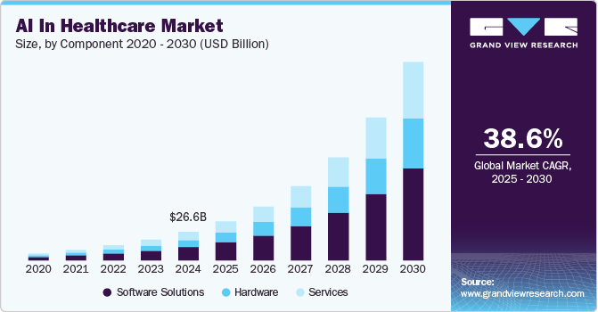
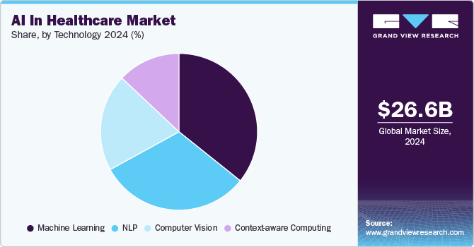
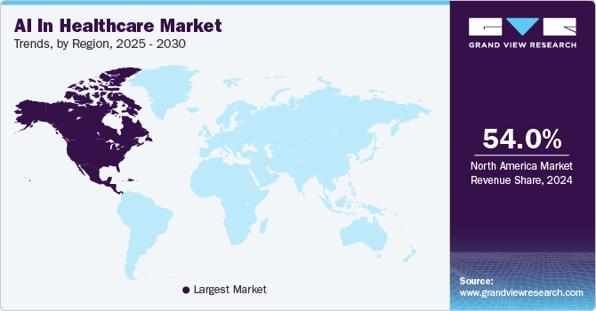

class: middle, center,  black-slide, title-slide

background-image: url(./figures/pic/voice-wave.gif)
background-size: cover

    

  

.larger-x.success[ПЛАТФОРМА ШТУЧНОГО IНТЕЛЕКТУ ДЛЯ ДИСТАНЦIЙНОГО АВТОМАТИЗОВАНОГО ВИЯВЛЕННЯ ТА ДIАГНОСТИКИ ЗАХВОРЮВАНЬ ЛЮДИНИ
] 

  

  .larger-x.bold[Біомедична інженерія і здоров’я людини]  

.left[Науковий керiвник 
.bold[Стіренко Сергій Григорович], д.т.н, проф.]  

Київ, 2025

  

---

class:  black-slide, middle
background-image: url("https://www.dropbox.com/scl/fi/ples3jkjtxpmh7j9l81w9/vecteezy-2.gif?rlkey=bfzhdgfcegdavmgl5dnnfdgof&st=1n6pcl3y&dl=1")
background-size: cover

# Зміст

.larger-x[ 
 

🎙️ Команда розробників  
🎙️ Опис проєкту   
🎙️ Суть проєкту та інновації   
🎙️ Стан реалізації проєкту  
🎙️ Фінансові параметри   
🎙️ Розмір ринку та тенденції         

]

---

class:  black-slide, middle, center
background-image: url("https://www.dropbox.com/scl/fi/ples3jkjtxpmh7j9l81w9/vecteezy-2.gif?rlkey=bfzhdgfcegdavmgl5dnnfdgof&st=1n6pcl3y&dl=1")
background-size: cover

.shadow.larger-xxx[Команда розробників]

---

class:  black-slide, middle
background-image: url("https://www.dropbox.com/scl/fi/ples3jkjtxpmh7j9l81w9/vecteezy-2.gif?rlkey=bfzhdgfcegdavmgl5dnnfdgof&st=1n6pcl3y&dl=1")
background-size: cover
count: false

.grid[
.kol-1-3[ 
.circle.center.width-60[]
.smaller-x.bold.center[.width-10[] Стіренко Сергій Григорович.smaller-x[$^1$]] 

.circle.center.width-60[]
.smaller-x.bold.center[.width-10[] Роковий Олександр Петрович.smaller-x[$^1$]] 

.circle.center.width-60[]
.smaller-x.bold.center[.width-10[] Кочура Юрій  Петрович.smaller-x[$^1$]] 
]
.kol-1-3[ 
.circle.center.width-60[]
.smaller-x.bold.center[.width-10[] Гордієнко Юрій Григорович.smaller-x[$^1$]] 

.circle.center.width-60[]
.smaller-x.bold.center[.width-10[] Алєнін Олег  Ігорович.smaller-x[$^1$]] 
]

.kol-1-3[ 
.circle.center.width-60[]
.smaller-x.bold.center[.width-10[] Павлюченко Михайло Іванович.smaller-x[$^2$]] 

.circle.center.width-60[]
.smaller-x.bold.center[.width-10[] Таран Владислав  Ігорович.smaller-x[$^1$]]
]

.kol-2-3[ .smaller-x[.smaller-x[$^1$] КПІ ім. Ігоря Сікорського, кафедра ОТ, ФІОТ 
.smaller-x[$^2$]  Запорізький державний медичний університет]]
]

---

class:  black-slide, middle, center
background-image: url("https://www.dropbox.com/scl/fi/ples3jkjtxpmh7j9l81w9/vecteezy-2.gif?rlkey=bfzhdgfcegdavmgl5dnnfdgof&st=1n6pcl3y&dl=1")
background-size: cover

.shadow.larger-xxx[Опис проєкту]

---
class:  black-slide, 

- У галузi охорони здоров’я спостерiгається стрiмке зростання застосування методiв штучного iнтелекту та збiльшення числа лiкарiв, якi використовують iнтелектуальнi методи обробки даних для прийняття клiнiчних рiшень.

---

class:  black-slide, 
count:false

- .inactive-b[У галузi охорони здоров’я спостерiгається стрiмке зростання застосування методiв штучного iнтелекту та збiльшення числа лiкарiв, якi використовують iнтелектуальнi методи обробки даних для прийняття клiнiчних рiшень.] 
- Особливе значення має застосування методiв комп’ютерного зору для аналiзу .bold[рентгенограм грудної клiтки] &mdash; найпоширенiшого радiологiчного дослiдження, яке виконує ключову роль для скринiнгу, дiагностики та лiкування захворювань органiв грудної порожнини, багато з яких є лiдируючими причинами смертностi у всьому свiтi.

---

class:  black-slide,
count:false

- .inactive-b[У галузi охорони здоров’я спостерiгається стрiмке зростання застосування методiв штучного iнтелекту та збiльшення числа лiкарiв, якi використовують iнтелектуальнi методи обробки даних для прийняття клiнiчних рiшень.] 
- .inactive-b[Особливе значення має застосування методiв комп’ютерного зору для аналiзу рентгенограм грудної клiтки &mdash; найпоширенiшого радiологiчного дослiдження, яке виконує ключову роль для скринiнгу, дiагностики та лiкування захворювань органiв грудної порожнини, багато з яких є лiдируючими причинами смертностi у всьому свiтi.]
- Сучаснi системи комп’ютерного зору продемонстрували високу ефективнiсть у задачах класифiкацiї та сегментацiї медичних зображень, проте iснує потреба в їх оптимiзацiї для досягнення точностi, швидкодiї та надiйностi, спiвставних або вищих за результати експертiв-радiологiв. 

---

class:  black-slide,
count:false

- .inactive-b[У галузi охорони здоров’я спостерiгається стрiмке зростання застосування методiв штучного iнтелекту та збiльшення числа лiкарiв, якi використовують iнтелектуальнi методи обробки даних для прийняття клiнiчних рiшень.] 
- .inactive-b[Особливе значення має застосування методiв комп’ютерного зору для аналiзу рентгенограм грудної клiтки &mdash; найпоширенiшого радiологiчного дослiдження, яке виконує ключову роль для скринiнгу, дiагностики та лiкування захворювань органiв грудної порожнини, багато з яких є лiдируючими причинами смертностi у всьому свiтi.]
- .inactive-b[Сучаснi системи комп’ютерного зору продемонстрували високу ефективнiсть у задачах класифiкацiї та сегментацiї медичних зображень, проте iснує потреба в їх оптимiзацiї для досягнення точностi, швидкодiї та надiйностi, спiвставних або вищих за результати експертiв-радiологiв.]
-  Раннє виявлення легеневих патологій, зокрема онкологічних, відкриває можливість пацієнтам отримувати ефективне лікування на початкових етапах, що може суттєво підвищити шанси на одужання та зменшити ризик ускладнень. Це обумовлює актуальнiсть розробки нових комплексних методiв глибинного машинного навчання для аналізу медичних даних.

---

class:  black-slide, middle
count:false

.exercise[Запропонована в рамках конкурсу платформа штучного iнтелекту для дистанцiйного автоматизованого виявлення та дiагностики захворювань людини дозволить кiнцевим споживачам (працiвникам медичних закладiв) створювати, розгортати та керувати спецiалiзованими ШI-додатками у гiбридних обчислювальних середовищах (на основi хмарних та периферiйних обчислень) з метою підтримки прийняття клінічних рішень та прискорення обробки великих обсягiв даних, що є критично важливим для реалiзацiї широкомасштабних скринiнгових програм та нацiональних iнiцiатив у сферi охорони здоров’я.]

---

class:  black-slide, middle, center
background-image: url("https://www.dropbox.com/scl/fi/ples3jkjtxpmh7j9l81w9/vecteezy-2.gif?rlkey=bfzhdgfcegdavmgl5dnnfdgof&st=1n6pcl3y&dl=1")
background-size: cover

.shadow.larger-xxx[Суть проєкту та інновації]

---

class:  black-slide, middle,

# Ідея

.quote[Впровадження інтелектуальної платформи штучного інтелекту для універсального автоматизованого аналізу медичних даних та підтримки прийняття клінічних рішень.]

???
Ідея полягає у впровадженні інтелектуальної платформи штучного інтелекту для універсального автоматизованого аналізу медичних даних та підтримки прийняття клінічних рішень, спрямованої на підвищення ефективності діагностики, зниження ризику медичних помилок і оптимізацію медичних закладів шляхом надання лікарю релевантних діагностичних підказок та швидкого аналізу великих обсягів медичних даних.

---

class:  black-slide, middle,

# Яку проблему вирішує проєкт?

.quote[У медичній практиці помилки поділяються на дві основні категорії: помилки сприйняття та когнітивні помилки, які призводять до невиявлення або неправильної інтерпретації патологій. Помилки сприйняття становлять 60–80% усіх радіологічних помилок [[1](https://www.ajronline.org/doi/10.2214/AJR.16.16963)] і є головною причиною високої частоти невиявлених аномалій. Крім того, деякі патології можуть залишатися непоміченими через технічні або фізичні обмеження методів візуалізації, такі як низька роздільна здатність зображень або обмежена контрастність тканин.]

.footnote[[S. Waite, J. Scott, B. Gale, T. Fuchs, S. Kolla, and D. Reede, “Interpretive error in radiology”, American Journal of Roentgenology, vol. 208, no. 4, pp. 739–749, 2017.](https://www.ajronline.org/doi/10.2214/AJR.16.16963)]

---

class:  black-slide, middle,
count: false

# Яку проблему вирішує проєкт?

.quote[Процес інтерпретації зображень залежить від візуального сприйняття, розпізнавання образів, пам’яті та аналітичного мислення лікаря. Проте робота лікарів виконується в умовах численних відволікаючих факторів, що підвищують навантаження та викликають втому. Через людський фактор певний рівень помилок у діагностиці є неминучим навіть у досвідчених спеціалістів.]

.footnote[[S. Waite, J. Scott, B. Gale, T. Fuchs, S. Kolla, and D. Reede, “Interpretive error in radiology”, American Journal of Roentgenology, vol. 208, no. 4, pp. 739–749, 2017.](https://www.ajronline.org/doi/10.2214/AJR.16.16963)]

---

class:  black-slide, middle,
count: false

# Яку проблему вирішує проєкт?

.quote[Впровадження інтелектуальної платформи штучного інтелекту у медичну практику допоможе знизити ризик медичних помилок та підвищити ефективність медичних закладів шляхом надання лікарю релевантних діагностичних підказок та швидкого аналізу великих обсягів медичних даних.]

---

class:  black-slide, middle,

# Інноваційна складова проєкту

.quote[На відміну від існуючих вузькоспеціалізованих рішень, запропонована платформа штучного інтелекту має модульну архітектуру, яка завдяки поєднанню методів глибинного навчання та мультимодальних даних забезпечує універсальність застосування в різних медичних напрямках, зокрема в радіології, пульмонології,  дерматології та гістології.]

---

class:  black-slide, middle, center
background-image: url("https://www.dropbox.com/scl/fi/ples3jkjtxpmh7j9l81w9/vecteezy-2.gif?rlkey=bfzhdgfcegdavmgl5dnnfdgof&st=1n6pcl3y&dl=1")
background-size: cover

.larger-xxx[Стан реалізації проєкту]

---

class:  black-slide, middle,

# ТRL 6
.larger-x[ Розроблений прототип для демонстрації в робочому середовищі]
  

.center.larger-x[[med.comsys.kpi.ua](https://med.comsys.kpi.ua/)]

---

class:  black-slide, 

# Подальший розвиток проєкту

- Зібрати та інтегрувати проспективні дані.

---

class:  black-slide,
count: false 

# Подальший розвиток проєкту

- .inactive-b[Зібрати та інтегрувати проспективні дані.]
- Розширити набір даних шляхом включення додаткових типів патологій, нових протоколів візуалізації, рідкісних клінічних випадків та текстових медичних записів з метою підвищення варіативності та стабільності моделей штучного інтелекту для різних модальностей.

---

class:  black-slide,
count: false 

# Подальший розвиток проєкту

- .inactive-b[Зібрати та інтегрувати проспективні дані.]
- .inactive-b[Розширити набір даних шляхом включення додаткових типів патологій, нових протоколів візуалізації, рідкісних клінічних випадків та текстових медичних записів з метою підвищення варіативності та стабільності моделей штучного інтелекту для різних модальностей.]
- Провести зовнішню валідацію розроблених моделей на незалежних клінічних даних із залученням кількох медичних закладів для перевірки узагальнюваності результатів.

---

class: middle, black-slide,

## Ключ до надійних моделей ШІ &mdash; дані 

.grid[
.kol-1-3[ 
.center.width-70[]
.bold.center[Правове регулювання]

.smaller-x.center[Медичнi данi є вкрай чутливими, пiдлягають правовому регулюванню через що не можуть бути легко поширенi та використанi третiми особами.]

]

.kol-1-3[ 
.center.width-70[]
.bold.center[Доступність даних]

.smaller-x.center[Найкорисніші медичні дані зберігаються переважно у приватному секторі. Дані розподілені між країнами, рідкісні дані ізольовані та розподілені фрагментарно.]
  ]

.kol-1-3[
 
.center.width-80[]
.bold.center[Захист приватності]

.smaller-x.center[Використання приватних даних із збереженням конфіденційності &mdash; це місія .bold[федеративного навчання].]

]]

???
Медичні дані про стан здоров'я є дуже чутливими і суворо захищаються законом.

Через це лікарні та установи не можуть легко обмінюватися даними про пацієнтів, навіть якщо це могло б допомогти вдосконалити системи ШІ.

Федеративне навчання вирішує цю проблему, навчаючи моделі ШІ без переміщення даних — вони залишаються локальними та приватними.

Найбільш корисні медичні дані зберігаються в приватних системах (таких як лікарні, лабораторії, клініки), а не в публічних наборах даних.

Ці дані:

- розподілені між країнами;
- ізольовані в окремих установах;
- часто містять рідкісні випадки.

Федеративне навчання є необхідним для створення точних, узагальнених і надійних моделей штучного інтелекту — навіть в умовах суворих правил конфіденційності та високого рівня розподіленості та ізольованості медичних даних.

---

class:  black-slide, middle, center
background-image: url("https://www.dropbox.com/scl/fi/ples3jkjtxpmh7j9l81w9/vecteezy-2.gif?rlkey=bfzhdgfcegdavmgl5dnnfdgof&st=1n6pcl3y&dl=1")
background-size: cover

.shadow.larger-xxx[Фінансові параметри]

---

class:  black-slide, middle,

.larger-x.quote[Умови інвестицій обговорюються з потенційними інвестором індивідуально.]

---

class:  black-slide, middle, center
background-image: url("https://www.dropbox.com/scl/fi/ples3jkjtxpmh7j9l81w9/vecteezy-2.gif?rlkey=bfzhdgfcegdavmgl5dnnfdgof&st=1n6pcl3y&dl=1")
background-size: cover

.larger-xxx[Розмір ринку та тенденції]

---

class: black-slide, middle

.width-100[]

.smaller-xx[.bold[CAGR] (Compound Annual Growth Rate)]

.alert[Ключовим фактором, що стимулює зростання ринку є зростаючий попит у сфері охорони здоров’я на підвищення ефективності, точності та покращення результатів для пацієнтів.]

.footnote[Джерело: [AI In Healthcare Market Size, Share, And Trends Analysis Report By Component (Hardware, Services), By Application, By End Use, By Technology, By Region (North America, Europe, APAC, Latin America, MEA), And Segment Forecasts, 2025 - 2030](https://www.grandviewresearch.com/industry-analysis/artificial-intelligence-ai-healthcare-market).]

---

class: black-slide, middle

.width-100[]

.alert.smaller-x[Очікується, що сегмент .bold[контекстно-орієнтованих обчислень]  буде мати найбільший темп зростання (CAGR) у період з 2025 по 2030 рік. Алгоритми ШІ зможуть інтегрувати й аналізувати різні джерела даних, такі як електронні медичні записи, показники життєво важливих функцій у реальному часі, медичну історію, фактори навколишнього середовища та активність пацієнта для динамічного визначення клінічного стану.]

.footnote[Джерело: [AI In Healthcare Market Size, Share, And Trends Analysis Report By Component (Hardware, Services), By Application, By End Use, By Technology, By Region (North America, Europe, APAC, Latin America, MEA), And Segment Forecasts, 2025 - 2030](https://www.grandviewresearch.com/industry-analysis/artificial-intelligence-ai-healthcare-market).]

---

class: black-slide, middle

.width-100[]

.alert.smaller-x[Північна Америка у 2024 році домінувала на світовому ринку ШІ в охороні здоров’я, забезпечивши найбільшу частку доходу &mdash; понад 54%. 

Великобританія очолила ринок ШІ в охороні здоров’я в Європі у 2024 році, а в Азіатсько-Тихоокеанському регіоні лідером був Китай.]

.footnote[Джерело: [AI In Healthcare Market Size, Share, And Trends Analysis Report By Component (Hardware, Services), By Application, By End Use, By Technology, By Region (North America, Europe, APAC, Latin America, MEA), And Segment Forecasts, 2025 - 2030](https://www.grandviewresearch.com/industry-analysis/artificial-intelligence-ai-healthcare-market).]

---

class: black-slide, middle

# Ключові компанії

Нижче наведені ключові гравці ринку ШІ в охороні здоров’я, які разом контролюють найбільшу частку ринку та формують основні тренди галузі:

.grid[
.kol-1-2[
- Microsoft
- IBM
- Google
- NVIDIA Corporation
- Intel Corporation
- Itrex Group]
.kol-1-2[
- GE Healthcare
- Medtronic
- Oracle
- Medidata
- Merck
- IQVIA
]]

.footnote[Credit: [AI In Healthcare Market Size, Share, And Trends Analysis Report By Component (Hardware, Services), By Application, By End Use, By Technology, By Region (North America, Europe, APAC, Latin America, MEA), And Segment Forecasts, 2025 - 2030](https://www.grandviewresearch.com/industry-analysis/artificial-intelligence-ai-healthcare-market).]

---

class:  black-slide, middle, 
background-image: url("https://www.dropbox.com/scl/fi/ples3jkjtxpmh7j9l81w9/vecteezy-2.gif?rlkey=bfzhdgfcegdavmgl5dnnfdgof&st=1n6pcl3y&dl=1")
background-size: cover

.center.shadow.larger-xxx[Контактні дані]

.grid[
.kol-1-1[ 
.circle.center.width-30[]
.larger-x.bold.center[.width-5[] Стіренко Сергій Григорович]  
.larger-x.center[✉️ s.stirenko@kpi.ua]
.larger-x.center[📞 +38 044 204 9121]]
]

---

class: black-slide, middle, center
count: false

.larger-xxx[⌛] 